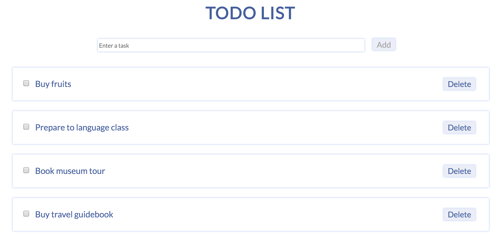

# ToDo List (React.js)
The "ToDo List" web application use `React.js` framework.

 
    

# Features
* Dissplay completed and uncompleted tasks
* Add/Delete tasks
* Adaptive Design for phones, tablets, desctops

# Configuration
The project requires compilation; we can do it with the `npm run dev` command.

# Frameworks and Tools
* ES6
* React.js
* SASS
* Web-pack
* Babel
* NanoId

# Components
The project uses two components, and they can be found in the `src/components` folder:
* ToDoItem
* ToDoList

The `ToDoItem` component is used for rendering a task.

The `ToDoList` component is used for storing tasks and rendering "list of tasks" and "add task" section.

# What to improve
* Add search
* Add possibility to mark task as a favourite
* Add possibility to create a task for a day (Monday)
* Store tasks on the server
* Improve UI/UX
